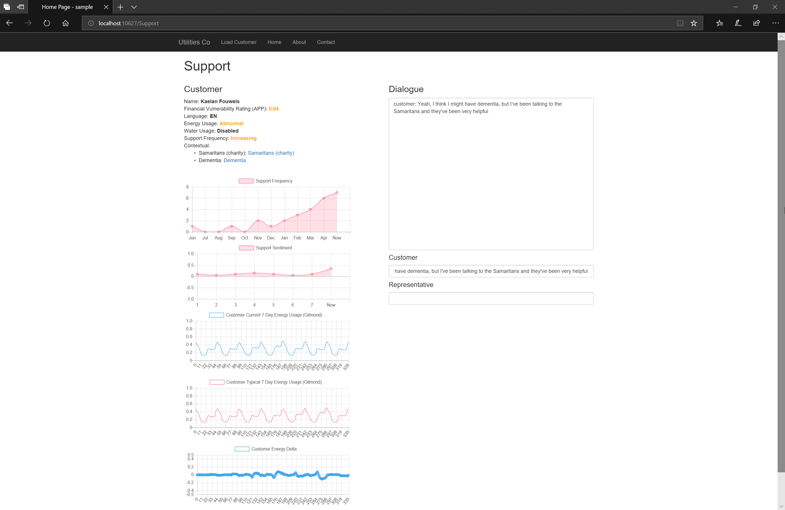

# Supporter

## Kaelan Thijs Fouwels

Vulnerably Customers - Can we Use machine learning to aid in the early detection of vulnerability traits, through it’s application to a customers historical utility usage data and support interactions?

Uses machine learning to analyse trends in user behaviour based on historical information and energy usage sourced from their support interactions and smart meters.

Builds up a profile of a user based on the above, allowing potential vulnerability indicators to be highlighted and contextual information provided to allow a proactive response before the customer becomes vulnerable.

Uses the following sources:
- Sentiment trends across support interactions
- Frequency trends of support requests
- Energy usage trends – Smart meter integration (Via Gilmond API)
- Financial Vulnerability – Open banking team’s API
- Machine Learning Key Text Entity Extraction

---

## Dependencies

- .NET Standard 2.0
- Newtonsoft JSON.NET (Nuget)
- Gilmond API

## How to run

- Populate the AzureAPIKey, GilmondUsername, and GilmondPassword const strings within helpers/AzureLanguage.cs
- Install the dotnet core runtime (https://www.microsoft.com/net/download/dotnet-core/runtime-2.0.5)
- Open a terminal in the src directory and executy `dotnet run`

---

## Potential further improvements

Add additional data sources to build up a better customer picture, and allow for more accurate determinations of vulnerabilities.

Increase the complexity of the machine learning and analysis.

Acquire smart meter Water data, in addition to electric.

Improve the basic UI created.

[Slides](./slides.pdf)
